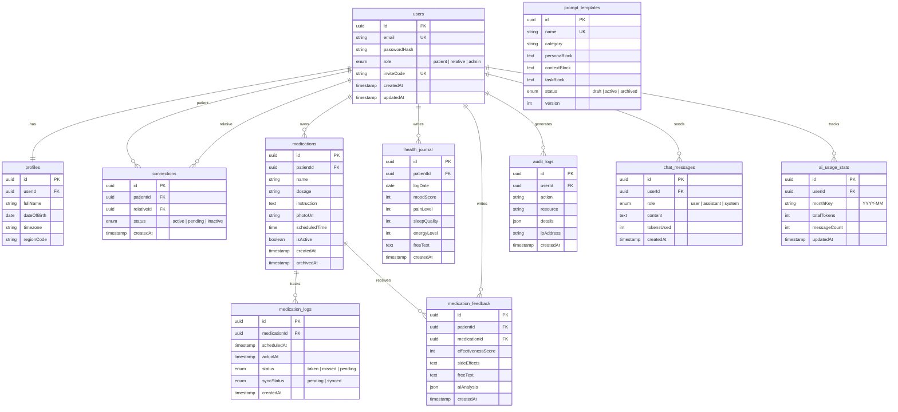

<!--
  @file: project.md
  @description: Детальное описание проекта MemoMed AI -- архитектура, стек, стандарты, этапы
  @dependencies: tasktracker.md, diary.md, qa.md, .cursorrules
  @created: 2026-02-22
-->

# MemoMed AI -- Проектная документация

> Версия: 1.1 | Дата: 2026-02-22 | Статус: Проектирование (все архитектурные вопросы решены)

## 1. Общее описание

### 1.1 Назначение

**MemoMed AI** -- веб-сервис с AI-ассистентом для контроля приема лекарств. Помогает пациентам (особенно пожилым с когнитивными особенностями) не пропускать прием лекарств, а родственникам -- дистанционно контролировать дисциплину.

### 1.2 Бизнес-модель

Бесплатный сервис для пациентов и родственников. Монетизация через freemium-аналитику обратной связи о лекарственных препаратах для фармацевтических компаний:

- **Бесплатный уровень**: минимальный набор агрегированных данных (средняя оценка эффективности, top-5 побочных эффектов)
- **Подписка**: глубокая аналитика (корреляции с возрастом/полом, тренды по регионам, сегментация по диагнозам, процент прерывания курса)
- **Анонимизация**: все данные обезличиваются перед передачей (удаление имени, email, замена userId на хэш)

### 1.3 Целевая аудитория

| Роль | Описание | Приоритет |
|------|----------|-----------|
| Пациент | Пожилые люди 60+ с хроническими заболеваниями, нарушениями памяти, принимающие 3+ лекарства | Основной |
| Родственник/Опекун | Дети, супруги, сиделки, соцработники | Основной |
| Врач | Анализ дисциплины, статистика (будущая версия) | Вторичный |

### 1.4 Ключевые особенности

1. **AI-помощник** (DeepSeek) -- отвечает на вопросы о лекарствах простым языком
2. **Настойчивые напоминания** -- система эскалации: T+0 → T+10 → T+20 → T+30
3. **Живая лента** -- родственники видят приемы в реальном времени (SSE)
4. **Offline-first** -- полная функциональность без интернета (PWA + IndexedDB)
5. **Умная аналитика** -- AI находит связи между симптомами и факторами
6. **Доступный дизайн** -- крупные элементы, контрастность AAA, screen readers

### 1.5 Проблемы, которые решаем

- 40-50% пациентов 65+ регулярно забывают принять лекарства
- Родственники не знают, принял ли близкий лекарство
- Существующие приложения перегружены функциями и мелкими элементами
- Нет инструмента сбора обратной связи о лекарствах от реальных пациентов

---

## 2. Архитектура

### 2.1 Общая схема


### 2.2 Архитектурный подход

**Web-first с возможностью мобильной упаковки:**

1. **Этап 1**: Адаптивный веб-сайт (PWA) -- работает в любом браузере
2. **Этап 2**: PWA устанавливается как приложение на телефон (Add to Home Screen)
3. **Этап 3** (опционально): Упаковка через Capacitor в Google Play / App Store

**Паттерны:**
- Clean Architecture (разделение на слои: UI → Business Logic → Data)
- Repository Pattern (единая точка доступа к данным)
- Offline-first (все операции сначала локально, затем синхронизация)

### 2.3 Компоненты системы

#### Frontend (Next.js App Router)

```
src/app/                    -- Страницы и API роуты
├── (auth)/                 -- Авторизация (login, register)
│   ├── login/page.tsx
│   └── register/page.tsx
├── (patient)/              -- Интерфейс пациента
│   ├── dashboard/page.tsx  -- Главный экран (часы + кнопка)
│   ├── medications/page.tsx -- Список лекарств
│   ├── add/page.tsx        -- Добавление лекарства
│   └── chat/page.tsx       -- AI-чат
├── (relative)/             -- Интерфейс родственника
│   ├── feed/page.tsx       -- Живая лента
│   └── calendar/page.tsx   -- Календарь дисциплины
├── api/                    -- API Routes
│   ├── auth/[...nextauth]/ -- NextAuth.js
│   ├── medications/        -- CRUD лекарств
│   ├── logs/               -- Синхронизация логов
│   ├── ai/chat/            -- DeepSeek чат (streaming)
│   ├── feed/               -- SSE для живой ленты
│   └── connections/        -- Связи пациент-родственник
├── layout.tsx              -- Корневой layout
└── page.tsx                -- Лендинг
```

#### Компоненты UI

```
src/components/
├── ui/                     -- shadcn/ui (Button, Card, Dialog, Input...)
├── patient/
│   ├── big-green-button.tsx    -- Кнопка подтверждения приема
│   ├── clock-widget.tsx        -- Адаптивные часы (15% ширины)
│   ├── medication-card.tsx     -- Карточка лекарства
│   └── medication-form.tsx     -- Форма добавления
├── relative/
│   ├── live-feed.tsx           -- Лента событий (SSE)
│   ├── calendar-view.tsx       -- Календарь дисциплины
│   └── feed-item.tsx           -- Элемент ленты
└── shared/
    ├── ai-chat.tsx             -- AI-чат виджет
    ├── ai-message-bubble.tsx   -- Пузырь сообщения
    ├── header.tsx              -- Шапка
    ├── bottom-nav.tsx          -- Мобильная навигация
    └── offline-indicator.tsx   -- Индикатор offline-режима
```

#### Backend (API + Worker)

| Компонент | Путь | Назначение |
|-----------|------|------------|
| Auth API | `src/app/api/auth/` | Регистрация, вход, JWT |
| Medications API | `src/app/api/medications/` | CRUD лекарств |
| Logs API | `src/app/api/logs/` | Синхронизация offline-логов |
| AI Chat API | `src/app/api/ai/chat/` | DeepSeek streaming чат |
| Feed API | `src/app/api/feed/` | SSE для живой ленты |
| Connections API | `src/app/api/connections/` | Инвайт-коды, связи |
| Reminder Worker | `worker/jobs/reminder.job.ts` | Cron: система эскалации |
| Sync Worker | `worker/jobs/sync.job.ts` | Обработка offline-очереди |
| Analytics Worker | `worker/jobs/analytics.job.ts` | AI-аналитика по расписанию |

---

## 3. Технологический стек

### 3.1 Frontend

| Технология | Версия | Назначение |
|-----------|--------|------------|
| Next.js | 14+ | React-фреймворк, App Router, SSR/SSG |
| TypeScript | 5.3+ | Типобезопасность |
| Tailwind CSS | 3.4+ | Utility-first стили |
| shadcn/ui | latest | Доступные UI-компоненты |
| Dexie.js | 4+ | IndexedDB wrapper (offline storage) |
| next-pwa | latest | PWA (Service Worker, manifest) |

### 3.2 Backend

| Технология | Версия | Назначение |
|-----------|--------|------------|
| Next.js API Routes | 14+ | REST API + SSE |
| NextAuth.js | 5+ | Аутентификация (JWT + sessions) |
| Prisma | 5+ | ORM для PostgreSQL |
| Zod | 3+ | Валидация входных данных |
| BullMQ | 5+ | Очереди задач (reminder, sync, analytics) |
| OpenAI SDK | 4+ | Клиент для DeepSeek API (совместимый) |

### 3.3 Инфраструктура

| Технология | Назначение |
|-----------|------------|
| PostgreSQL 14+ | Основная БД |
| Redis 7+ | Кэш AI-ответов, очереди BullMQ, сессии |
| Docker + docker-compose | Контейнеризация |
| Nginx | Reverse proxy, SSL termination |
| Let's Encrypt | SSL-сертификаты |

### 3.4 Тестирование

| Технология | Назначение |
|-----------|------------|
| Vitest | Unit и integration тесты |
| Testing Library | Тестирование React-компонентов |
| Playwright | E2E тесты |
| MSW | Mock Service Worker для тестов API |

### 3.5 Инструменты разработки

| Инструмент | Назначение |
|-----------|------------|
| ESLint | Линтинг TypeScript/React |
| Prettier | Форматирование кода |
| Husky + lint-staged | Pre-commit hooks |
| GitHub Actions | CI/CD |

---

## 4. LLM-интеграция (DeepSeek)

### 4.1 Почему DeepSeek

- **Совместимость**: OpenAI SDK, меняем только `baseURL`
- **Стоимость**: ~$0.14/1M input tokens (в 18 раз дешевле GPT-4o)
- **Оплата**: удобная оплата из РФ
- **Качество**: хорошая поддержка русского языка
- **Стриминг**: поддержка streaming для чата

### 4.2 Точки применения LLM


### 4.3 Семь точек интеграции

| # | Функция | Модель | Temp | Max tokens | Кэш |
|---|---------|--------|------|------------|------|
| 1 | AI-чат помощник | deepseek-chat | 0.7 | 500 | Redis 1ч |
| 2 | Парсинг инструкций | deepseek-chat | 0.1 | 1000 | Нет |
| 3 | Анализ симптомов | deepseek-chat | 0.1 | 2000 | Нет |
| 4 | Корреляционная аналитика | deepseek-chat | 0.1 | 2000 | Redis 24ч |
| 5 | Генерация отчетов | deepseek-chat | 0.3 | 3000 | Нет |
| 6 | Анализ обратной связи | deepseek-chat | 0.1 | 1500 | Нет |
| 7 | Персонализация напоминаний | deepseek-chat | 0.5 | 200 | Redis 7д |

### 4.4 Системный промпт (AI-чат)

```
Ты -- MemoMed AI, заботливый медицинский ассистент для пожилых людей.

РОЛЬ:
- Помогать пациентам понимать инструкции к лекарствам
- Отвечать на вопросы простым, понятным языком
- Быть мягким и поддерживающим

ПРАВИЛА:
1. Отвечай КРАТКО (2-3 предложения максимум)
2. Используй простые слова без медицинских терминов
3. НЕ ставь диагнозы и НЕ заменяй врача
4. При серьезных жалобах -- рекомендуй обратиться к врачу
5. Будь добрым и терпеливым
6. Обращайся на "Вы" с уважением
```

### 4.5 Token Budget

- **Лимит**: 50 000 токенов/месяц на пользователя (~100 сообщений)
- **Хранение**: Redis counter `ai:tokens:{userId}:{YYYY-MM}` (TTL 35 дней)
- **Агрегация**: ежедневный worker → PostgreSQL таблица `ai_usage_stats`
- **При достижении лимита**: сообщение "Лимит AI-помощника исчерпан, обновится 1-го числа"

### 4.6 Хранение истории чата

- Таблица `chat_messages` в PostgreSQL (не на клиенте)
- Поля: userId, role, content, tokensUsed, createdAt
- Хранение: 30 дней, затем автоочистка (worker job)
- Позволяет: продолжение диалога, анализ частых вопросов, контроль budget

### 4.7 Архитектура LLM-сервиса

```
src/lib/ai/
├── deepseek.service.ts     -- Единый клиент DeepSeek (streaming + обычный)
├── prompts/
│   ├── chat.prompt.ts      -- Системный промпт для чата
│   ├── parse.prompt.ts     -- Промпт для парсинга инструкций
│   ├── analyze.prompt.ts   -- Промпт для анализа симптомов
│   └── report.prompt.ts    -- Промпт для генерации отчетов
├── cache.service.ts        -- Redis-кэширование ответов
└── token-budget.ts         -- Контроль расхода токенов по пользователям
```

---

## 5. База данных

### 5.1 ER-диаграмма



### 5.2 Ключевые отличия от исходной схемы (DOC/)

1. **Добавлена таблица `audit_logs`** -- аудит-логирование доступа к медданным
2. **Добавлена таблица `medication_feedback`** -- обратная связь по препаратам (бизнес-модель)
3. **Добавлена таблица `chat_messages`** -- серверное хранение истории AI-чата (30 дней, автоочистка)
4. **Добавлена таблица `ai_usage_stats`** -- мониторинг расхода токенов (50K/месяц/пользователь)
5. **Удалена функция `reset_daily_medication_flags()`** -- она содержала баг, уничтожавший историю приемов. Логи теперь иммутабельны.
6. **Invite-код увеличен до 12 символов** -- защита от перебора
7. **Индекс на `medication_logs(scheduledAt)`** -- для партиционирования по дате

### 5.3 Стратегия партиционирования

Таблица `medication_logs` -- основная аналитическая таблица, растет быстро. Стратегия:
- Партиционирование по месяцам (`scheduledAt`)
- Горячие данные (текущий месяц) в основной партиции
- Архивные данные в отдельных партициях
- Автоматическое создание партиций через pg_cron

---

## 6. Безопасность

### 6.1 Аутентификация

- NextAuth.js с JWT-стратегией
- Хэширование паролей: bcrypt (12 rounds)
- Время жизни access token: 1 час
- Refresh token: 7 дней
- Хранение на клиенте: httpOnly cookie (не localStorage)

### 6.2 Авторизация (RBAC)

| Роль | Права |
|------|-------|
| patient | CRUD своих лекарств, отметка приема, AI-чат, дневник здоровья |
| relative | Чтение ленты связанных пациентов, календарь, получение уведомлений |
| admin | Управление пользователями, промптами, аналитика |

### 6.3 Защита данных

- HTTPS обязателен (Let's Encrypt)
- Все API через аутентификацию (кроме /auth и лендинга)
- Rate limiting: 100 req/15min (общий), 20 req/15min (AI-чат)
- Валидация всех входных данных (Zod schemas)
- CSRF-защита через NextAuth.js
- Content Security Policy headers
- Аудит-логирование всех операций с медданными
- Invite-код: 12 символов, одноразовый, TTL 7 дней, rate-limited

### 6.4 Согласие на обработку данных (ФЗ-152)

При регистрации пользователь обязан дать согласие:
1. **Обязательное**: политика обработки персональных данных (без этого регистрация невозможна)
2. **Опциональное**: участие в программе обратной связи по лекарствам (отдельный чекбокс)

### 6.5 Медицинские данные

- Данные хранятся на территории РФ (VPS в РФ -- Timeweb/Selectel)
- Логи приема иммутабельны (append-only)
- Обратная связь анонимизируется перед передачей третьим лицам
- Пользователь может экспортировать и удалить свои данные
- Медицинский дисклеймер: обязательный при первом использовании AI-чата + в каждом ответе AI

---

## 7. Offline-first стратегия

### 7.1 Архитектура


### 7.2 Что работает offline

| Функция | Offline | Синхронизация |
|---------|---------|---------------|
| Просмотр списка лекарств | Полностью | При подключении |
| Отметка приема | Полностью | Background Sync |
| AI-чат | Только кэш | Недоступно |
| Живая лента | Только кэш | SSE при подключении |
| Добавление лекарства | Полностью | При подключении |

### 7.3 Разрешение конфликтов

Стратегия: **Last Write Wins** с клиентским timestamp.
При конфликте (одна запись изменена и на клиенте, и на сервере) -- побеждает запись с более поздним `updatedAt`.

---

## 8. Система напоминаний

### 8.1 Логика эскалации

| Время | Уровень | Действие | Канал |
|-------|---------|----------|-------|
| T+0 | Мягкое | Push-уведомление + звук | Web Push |
| T+10 мин | Среднее | Повторное уведомление + вибрация | Web Push |
| T+20 мин | Сильное | Громкий звук + пульсация экрана | Web Push + UI |
| T+30 мин | Критическое | Уведомление родственнику | Web Push → Relative |

### 8.2 Реализация

- **Клиент**: Web Push API + Notification API
- **Сервер**: BullMQ delayed jobs
- При T+0 создаются 4 отложенных задачи в Redis (T+0, T+10, T+20, T+30)
- Если пациент подтвердил прием -- оставшиеся задачи отменяются
- T+30 триггерит Push для всех связанных родственников

---

## 9. Дизайн-система

### 9.1 Принципы

- **Воздушный минимализм** -- максимум пространства, минимум элементов
- **Крупные элементы** -- шрифт от 18px, кнопки от 48x48px
- **Контрастность AAA** -- по WCAG 2.1
- **Mobile-first** -- начинаем с мобильной версии

### 9.2 Цветовая палитра

| Название | HEX | Применение |
|----------|-----|------------|
| Background | #FFFFFF | Основной фон |
| Background Alert | #FFF9E6 | Фон при напоминании |
| Primary (Purple) | #7E57C2 | Акцентный цвет, навигация |
| Success (Green) | #4CAF50 | Кнопка приема, статус "принято" |
| Warning (Yellow) | #FFC107 | Опоздание, напоминание |
| Error (Red) | #F44336 | Пропуск, критическое |
| Text Primary | #212121 | Основной текст |
| Text Secondary | #757575 | Второстепенный текст |

### 9.3 Типографика

| Элемент | Шрифт | Размер | Вес |
|---------|-------|--------|-----|
| Часы | Montserrat | адаптивный (15% ширины) | 500 |
| Заголовки | Inter | 24-32px | 600 |
| Названия лекарств | Inter | 24px | 500 |
| Основной текст | Inter | 18px | 400 |
| Подсказки | Inter | 16px | 400 |

### 9.4 Ключевые экраны

**Главный экран пациента:**
- Динамический фон (белый → желтый при напоминании)
- Крупные цифровые часы (центр, 15% ширины)
- Название следующего лекарства + дозировка
- Большая круглая зелёная кнопка (120px диаметр) с иконкой галочки
- Мягкая анимация при нажатии + двойная вибрация

**Живая лента родственника:**
- Список событий с цветовой индикацией (зелёный/жёлтый/красный)
- Real-time обновление через SSE
- Статистика дисциплины за период

---

## 10. Этапы разработки (Roadmap)

### Этап 1: MVP (v1.0) -- 6 недель

**Цель**: минимально работающий продукт для тестирования на реальных пользователях.

- Инициализация проекта (Next.js, Prisma, Docker)
- Регистрация и аутентификация (NextAuth.js)
- CRUD лекарств
- Главный экран пациента (часы + кнопка подтверждения)
- Offline-first (IndexedDB + Background Sync)
- Синхронизация с сервером
- Связь пациент-родственник (инвайт-код)
- Живая лента (SSE)
- AI-чат помощник (DeepSeek, streaming)
- PWA (Service Worker, manifest, installability)
- Базовые тесты
- Docker-деплой на VPS

### Этап 2: Доработки (v1.1) -- 3 недели

- Календарь дисциплины с цветовой индикацией
- Web Push напоминания (система эскалации T+0...T+30)
- Загрузка фото упаковок лекарств
- Статистика и дашборд
- Онбординг (обучающие экраны для пожилых пользователей)
- Text-to-Speech для напоминаний (Web Speech API, опционально)

### Этап 3: Аналитика (v1.2) -- 4 недели

- Дневник самочувствия
- Интеграция метеоданных (OpenWeather API)
- AI-анализ корреляций (симптомы × погода × лекарства)
- Экспорт отчетов для врача (PDF)
- Сбор обратной связи по лекарствам

### Этап 4: Мобильные приложения (v2.0) -- 4 недели

- Capacitor-обёртка для Android
- Capacitor-обёртка для iOS
- Публикация в Google Play и App Store
- Native Push через Firebase/APNs

### Этап 5: Масштабирование (v2.1) -- 3 недели

- Локализация (английский язык)
- Роль "Врач" (просмотр статистики пациентов)
- Premium-функции (расширенная аналитика)
- Панель админа для управления промптами и аналитикой

---

## 11. Стандарты разработки

### 11.1 Git

- **Ветвление**: `main` (production) → `develop` (staging) → `feature/*`, `fix/*`
- **Коммиты**: Conventional Commits (`feat:`, `fix:`, `refactor:`, `docs:`, `test:`)
- **PR**: обязательный code review, проход CI
- **Pre-commit**: ESLint + Prettier + type-check через Husky

### 11.2 Код

- TypeScript strict mode
- Функциональный стиль (pure functions, иммутабельность)
- Server Components по умолчанию; `"use client"` только при необходимости
- Именование: файлы kebab-case, компоненты PascalCase, утилиты camelCase
- Один компонент / один файл
- Валидация на входе (Zod), типизация на выходе
- Никакого `any`, закомментированного кода, TODO-комментариев в main

### 11.3 Тестирование

- Unit-тесты для бизнес-логики (AI-сервис, reminder-логика, sync-логика)
- Integration-тесты для API routes
- E2E-тесты для критических путей (регистрация → добавление лекарства → прием)
- Целевое покрытие: 80%+ для бизнес-логики

### 11.4 Документация

- Файловые заголовки (`@file`, `@description`, `@dependencies`, `@created`)
- API-документация в `docs/` (OpenAPI/Swagger -- в будущем)
- Обновление `docs/project.md` при изменении архитектуры
- Обновление `docs/diary.md` при принятии значимых решений
- Обновление `docs/tasktracker.md` при изменении статуса задач

---

## 12. Инфраструктура

### 12.1 Docker-compose (development)

```yaml
services:
  app:         # Next.js приложение (порт 3000)
  worker:      # BullMQ worker
  postgres:    # PostgreSQL 14 (порт 5432)
  redis:       # Redis 7 (порт 6379)
```

### 12.2 Серверные требования (production)

| Ресурс | Минимум | Рекомендуемо |
|--------|---------|-------------|
| CPU | 2 ядра | 4 ядра |
| RAM | 2 GB | 4 GB |
| Диск | 40 GB SSD | 80 GB SSD |
| ОС | Ubuntu 22.04+ | Ubuntu 24.04 |

### 12.3 Мониторинг

- **Health check**: `/api/health` (проверка БД, Redis, DeepSeek)
- **Логирование**: структурированные JSON-логи (Pino)
- **Ошибки**: Sentry (бесплатный tier)
- **Метрики**: встроенные метрики Next.js + custom (LLM token usage)

---

## Ссылки

- [Трекер задач](tasktracker.md)
- [Дневник разработки](diary.md)
- [Вопросы по архитектуре](qa.md)
- [Правила для AI-ассистентов](../.cursorrules)
- [Исходные документы](../DOC/)
